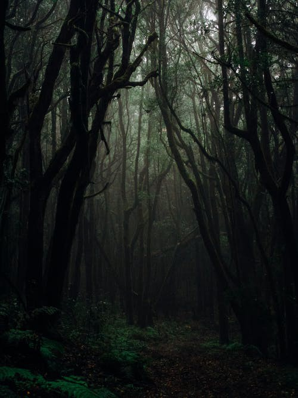

*We’re destined as inhabitants of this universe to abide by the laws of nature; it’s a nature that has no morality and it’s a nature that certainly doesn’t give a fuck about us.*

While most of us are caught up in trying to convince religious individuals of the validity of the theory of evolution, we haven’t spent as much time examining the ramifications of such a theory.

When we discuss the theory of evolution, we do so in terms of its past and how it has shaped the living organisms we have today. We rarely stop to think about what implications evolution has on our society, families, and ourselves.

Evolution dictates that the strongest phenotypes survive and reproduce, while the weak ones die out before they can do so. What’s not considered is why there is an inherent need for organisms to be continuously adapting.

# **Before we can understand nature we must understand what Life is.**

***Life** is a characteristic that distinguishes physical entities that have biological processes, such as signaling and self-sustaining processes, from those that do not, either because such functions have ceased (they have died), or because they never had such functions and are classified as inanimate.*

That’s a nice textbook definition, but here’s my definition of life that’s hopefully more meaningful and thought provoking.

**Life is the part of physics that fights against entropy.** In a world devoid of life, the universe would be 100 percent deterministic plus or minus some quantum possibilities. Life runs contrary to everything the universe dictates.

Life was never meant to exist or had a little probability of ever doing so. Life requires there to be a set of molecules arranged in such a way that it’s continuously self-replicating.

*Life is an example of complexity arising from many, many small simple things.*

It’s only through continuous self replication that life ever existed in the first place. The percentage of mass that’s biomass on earth even today is astronomically small compared to the inanimate physical matter we’re surrounded by. Without the processes of self-replication and growth life wouldn’t have had any chance .

Life is some design conceived of an all knowing creator. Life is an imperfect combination of molecules that’s just capable enough to survive.

**It’s not that life is created to survive, but it’s the life that’s better at surviving that ends up staying around.**

This leads us to the next horrifying reality…

# **Humans are also just Life Forms trying to survive.**

[WInter Forest](../images/blog-post/winter_forest.jpg)

This may seem like the most obvious statement ever, but it has to be stated because so many of us have forgotten or are ignorant of the fact. Our society has developed enough to the point where most people in developed countries are far removed from the realities of nature.

Most of us aren’t under the threat of starving to death, being eaten by predators, or dying from exposure from the elements. They surely used to be an extensive part of human experience, before the likes of agriculture, law, and industry came to be.

***Being a part of nature means that we are under constant pressure to survive. Most of us have forgotten this fact of life, but reality can never be forgotten forever.***

[Skull and bones decomposing](../images/blog-post/dark_forest.jpg)

Our societies are not perfect. They are wrought with injustices, inefficiencies, and outright malice. But then when you consider the unsurmountable realities of nature that we had to overcome to get to this point, you start to appreciate just how lucky we are to have even gotten this far.

Remember, nature has no sense of morality or justice. **Nature has no values nor is it capable of love or compassion.** Nature is just the laws of physics played out on the universe through 13.8 billion years. There is no guiding meaning or purpose behind it all.

# “Life is nasty, brutish, and short”―Thomas Hobbes

Most animals live short lives full of suffering. They die from disease, starvation, or are straight out consumed by another living organism. This was the human condition before civilizations rose and wrought gave us some degree of control over nature.

As far as we can tell, humans are the only things in the universe with a sense of morality. We know the difference between good and evil, right and wrong, virtue and vice, justice and crime. Nature works in opposition, or more likely it’s just a non-player — an unconscious playground.

> “I fully subscribe to the judgment of those writers who maintain that of all the differences between man and the lower animals the moral sense or conscience is by far the most important” — Charles Darwin

With Nature established as this force devoid of morality, it’s up for us humans with our ideas of morality and conscious brains to bring more good into this world.

Say what you will about the countless imperfections present in society, but just remember what it has replaced.

1. Life was never meant to exist.
2. We were never meant to exist.
3. What was never meant to exist won’t have an easy time continuing to exist.
4. Life is hard and the world is full of problems because of where we started.

*There is no guarantee of our survival or prosperity, which means that we’ve worked hard and fought for everything we have today.*

The world is full of problems and we have the ethical duty to solve them. It’s not only because we should, but also because we’re the only ones that can.

Life is hard because of the realities of nature. Luckily for us, we have *conscious minds that can act in defiance to nature*. Why waste the one thing that’s to our advantage. Think, plan and act. We have more control than we care to realize.