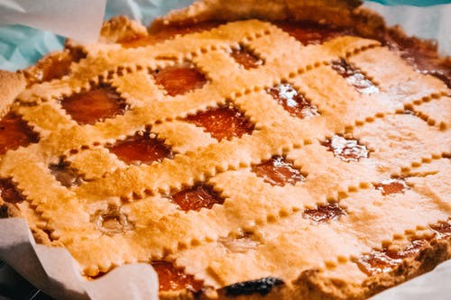
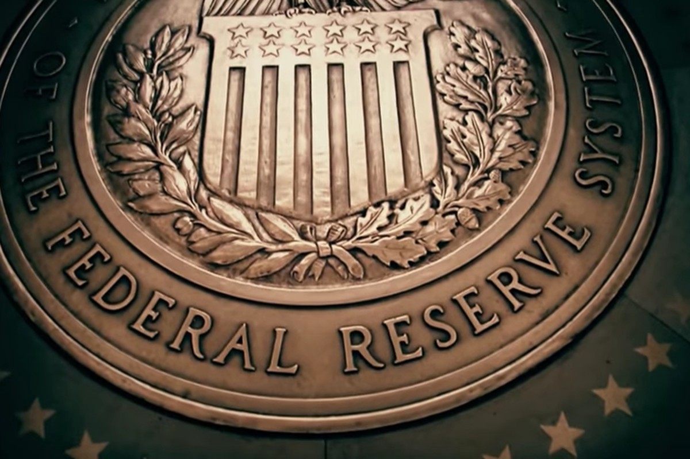

*The main goal of an economy is to provide the greatest amount of wellbeing to its participants. If it were to stop growing, these participants wouldn’t be all too happy about it.*

Economics is the study of how we as a society and species **allocate resources in a world with unlimited wants and limited resources**. It is this core issue the whole field of economics is predicated on.

This is what we would call an axiom *(a statement or proposition which is regarded as being established, accepted, or self-evidently true: from Greek axiōma ‘what is thought fitting’, from Axios ‘worthy’).* Every argument ever made has stemmed from one of these ‘axioms’.

**Using this axiom, I’ll make the simple, yet crucial argument that the economy requires long term growth for our current societies to continue existing in their current form.**

# **Imagine an apple pie…**

Imagine that there’s an apple pie that comes every day. The apple pie is then sliced into slices of varying sizes. You are given a slice, but you see that it’s smaller than the slice of the person next to you (let’s call him Tod). You don’t feel satisfied with the slice you were given. You remain hungry, but there’s only one pie.

The next day comes and you notice that the apple pie is larger than it was yesterday. You’re given a slice that is larger than the one yesterday. You’re still *hungry*, but at least there are signs of improvement. You even see that Tod’s slice has grown more than yours, but alas the apple pie continues to grow.

*The social order is working well enough for you. You see room for growth. You continue to abide by its rules.*

**Now what happens if the pie stops growing or god forbid it starts to shrink?**

You notice that the pie hasn’t been growing at all in the past month. It must just be the size of the pan. It’ll surely be replaced with a larger pan and the pie can continue on growing. You remain hopeful that your needs will be eventually met.

It’s been a year since any growth and you even notice the pie shrinking slightly. You need more, want more. *There’s only one way your slice can get bigger:* someone else’s slice must become smaller. It’s a zero-sum game. *Tod’s slice of the pie is no longer something you’re willing to tolerate so easily.*

> In a zero-sum game, the problem is entirely one of distribution, not at all on of production — Kenneth Neal Waltz

Now imagine that slice of the pie you’ve been receiving the whole time is the net representation of all resources you have at you’re disposal. In other words, it’s a representation of your life satisfaction. Sure you can try and be happy with less, but that’s a mightily difficult task when you’re struggling to feed your family. Even if you’ve got what you need and are satisfied, there’ll be others who don’t feel the same way.

# Why is Economic Growth is Necessary?

From the subjectivist standpoint, everything is subjective and nothing matters. For the sake of this argument, let’s assume that we’re in favor of human wellbeing and prosperity, which is a fairly easy position to hold without much contention. With this source of truth, economic growth becomes essential to maintain.

### The consequences that arise from the absence of economic growth are so astronomical to the point that growth becomes necessary.

*The absence of economic growth means that society itself becomes a zero-sum game or worse.*

A zero-sum type of environment leads to ideologies kin to mercantilism where resources are exploited and fought for endlessly. It’s far removed from the cooperation of globalism that we’ve grown custom to in the past few decades. You may think that the society we live in already has enough cut-throat competition, but it’s nothing compared to societal upheavals that can arise from long-term stagnant and uneven economies.

Society doesn’t exist; it’s a human construct made by self-interested individuals. Societies collapse when enough of these individuals get fed up with the status quo. An incompetent government along with a shrinking pie were the main contributors to both the French and Russian revolutions. This is a very simplified way to view these two historical events, but it’s clear that these two events wouldn’t have occurred had there been year on year economic growth.

A societal collapse or restructuring today would affect the lives of millions or even billions of people. It’s the type of event to try and avoid at all costs. **It’s the reason why our economy is set up the way it’s set up.**

It’s simply human nature to want and ask for more. Our brains are hardwired for survival. *****There’s a constant need for more. **Our societies have to serve this need or face ruin.*** Even if it’s possible for a certain number of us to be content with what little we have, it’s clear that there are many who are largely incapable of doing so.

Today’s neoliberal society exists because of this need for more. You could call greed or sin, but the reality remains the same; our society as it stands now is hard-wired to grow as much as possible. Human societies need to grow to escape the wraith and cold of nature.

**Now, how is this concept reflected within society?**

Most people will agree that society has had economic growth as its main priority for some time now. There are institutions such as the Federal Reserve whose sole purpose is to ensure maximum economic growth through its monetary policy. Banks are encouraged to lend more to consumers, causing the massive amounts of debt we see today. Government bailouts are handed out hoping to shorten economic recessions.

*This is all done in an a effort to keep the economy growing.*

To understand something, you must first understand the reasonings behind it. When it comes down to it, economics is all about maximizing growth. Other economics concepts such as opportunity cost and marginal utility exist to increase useful production.

Hopefully, this post was insightful or helpful to you in any way. In today’s world, it’s not enough to understand things on a rudimentary memorization level. **Understanding ideas at their core is what true learning is.**

> “If you’re memorizing it’s an indication that you don’t understand” -Naval Ravikant