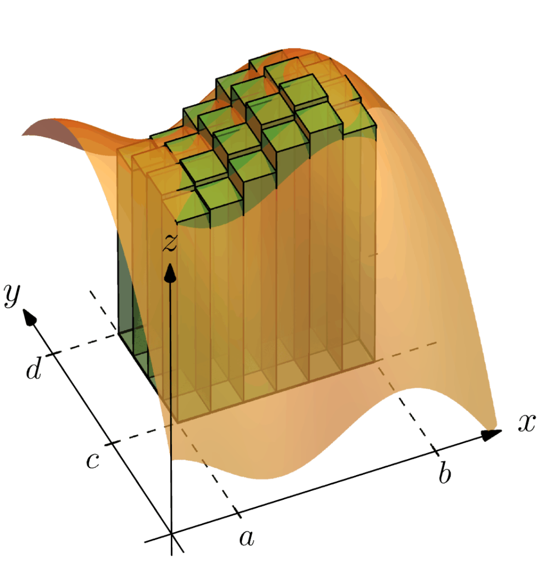

Integration is the mathematical process of finding the area under the curve given the equation of the curve. It is often used in the uni-variate situations, but for real life applications in physics, it is required to apply integration with multiple variables. For the uni-variate case we can calculate the distance travelled given a velocity function. For a bi-variate case and further we are able to calculate much more practical situations such as volumes, center of masses and moments of inertia. The difference between uni-variate and multivariate case is not a lot but there are a few quirks that require us to understand integration from a fundamental level. This is not an exploration on definite integration, it's meant to explore how uni-variate turns multivariate with the assumption that we already know how to conduct definite integration.

# 1. Introduction
This exploration is going to focus on how multivariate integration works and some of its many useful applications. Multivariate integration is a branch of multivariate calculus, which is in turn a part of the overarching math domain of calculus. The exploration on this topic stood out to me because of its many applications and its complexity. Even though it’s on the level of some undergraduate courses, the process feels intuitive to me.
For this exploration I will first explain the concept of integration and how it works, then I will follow up on what is changed/added when we do integration on multiple variables. After that I will go over different application with increasing difficulty and complexity, from the applications of multivariate integration for volumes to centers of mass.
# 2. How does integration work?
Integration is a part of calculus which is used to find the area under a function by essentially splitting the area under the function into an infinite rectangles with infinitesimal width and then adding them to basically get an infinite series. So we will define every infinitesimal width as $\delta x$ which is the smallest change in x possible. Then we multiply the $\delta x$ with $f(x)$ to get the area of one of the rectangles. To get the area of the whole area under the curve between points a and b we take the infinite sum.
$${\sum_{i=a}^b} \delta x_i f(x)$$
But wait, the $\sum$ notation only adds up by increasing the i by one so what we need is the integral notation which does take a infinite sum of all of the multiples of $\delta x$ and $f(x)$ between the values of x, a and b.
$$\int_a^b f(x) \delta x$$
It is important to note here that the x is the variable here since the value of the function is reliant on what the value of x is. And for the that reason, we multiply the value of the change of the variable with the value of the function for what the variable changed into. This process becomes more accurate the smaller the change in the variable becomes.
$/Latex /delta$